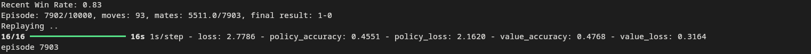

# Gumbel AlphaZero for Chess


## Abstract

This repository provides a comprehensive implementation of a Gumbel AlphaZero (GAZ) agent applied specifically to the domain of chess. The project investigates the synthesis of deep convolutional neural networks with Sequential Halving Monte Carlo Tree Search (MCTS) and Gumbel noise exploration. This methodology aims to achieve superior sample efficiency and more robust policy improvement targets compared to standard AlphaZero implementations.

The baseline training loop evaluates the King and Queen versus King (KQK) endgame to facilitate rapid empirical demonstration of convergence. However, the underlying architecture and environment wrappers are fully generalized to support training and inference on arbitrary chess positions or complete games.

<p align="center">
  
  <br>
  <em>Figure 1: The Gumbel AlphaZero agent executing self-play.</em>
</p>

## Methodology

The architecture relies on several advanced modifications to the traditional reinforcement learning paradigms used in deterministic perfect-information games:

* **Gumbel-Max Exploration**: Replaces standard Dirichlet noise with Gumbel noise sampling. By applying the Gumbel-Max trick at the root node of the search tree, the agent achieves robust action selection and continuous exploration without requiring a prohibitively high number of search simulations ($N$).
* **Sequential Halving**: Utilizes a dynamic search budget allocation strategy. The algorithm evaluates candidate actions and progressively prunes low-value branches. This maximizes search depth for promising trajectories within strictly constrained computational limits.
* **Dual-Headed Convolutional Architecture**: Implements a deep Convolutional Neural Network (CNN) featuring bifurcated outputs. The policy head approximates the optimal move probabilities, while the value head approximates the expected game outcome (win, draw, or loss).
* **Self-Play Reinforcement Learning**: The agent functions autonomously, generating its own training data through iterative self-play. This ensures rigorous policy evaluation and continuous, monotonic improvement over successive training epochs.
* **Generalized State Representation**: Supports state initialization and serialization via standard Forsyth-Edwards Notation (FEN) or Portable Game Notation (PGN), ensuring interoperability with existing chess engines and databases.

## Empirical Results

The agent demonstrates steady convergence during the self-play training phase. The log below captures a specific training epoch, highlighting the reduction in policy and value loss alongside increasing predictive accuracy and a stabilizing win rate.

<p align="center">
  
  <br>
  <em>Figure 2: Console output demonstrating training progression, win rate tracking, and loss metrics over 7903 episodes.</em>
</p>

## Theoretical Framework

### Simulation Budget Allocation

Traditional AlphaZero relies on the PUCT (Predictor + Upper Confidence Bound applied to Trees) algorithm, which necessitates an extensive number of node visitations to form a reliable policy target. Gumbel AlphaZero optimizes this limitation through Sequential Halving. 


Given a fixed budget of $N$ simulations, the algorithm evaluates an initial set of $K$ candidate actions. It retains the top $K/2$ candidates based on their estimated action values, then the top $K/4$, continuously doubling the visit counts for the surviving actions at each subsequent stage until a single optimal action remains.

### Policy Improvement Target

Unlike standard AlphaZero which trains the neural network to match the raw distribution of visit counts, Gumbel AlphaZero optimizes the network policy to minimize the Kullback-Leibler divergence from a search-improved policy, denoted as $\pi'$. The improved target policy is mathematically formulated as:

$$\pi' \propto \text{softmax}(\text{logits} + \sigma(Q_{\text{completed}}))$$

This formulation ensures the network internalizes the empirical value distributions discovered during the tree search rather than exclusively fitting to raw visitation frequencies, significantly accelerating the learning process.

## Repository Structure

```text
chess-endgame-mcts/
├── docker-compose.yml           # Docker services configuration
├── dockerfile                   # Docker image definition
├── images/                      # Project assets
│   └── mate.png
├── model_checkpoint.weights.h5  # Serialized model weights
├── readme.md                    # Project documentation
├── requirements.txt             # Python dependency specifications
└── src/                         # Source code directory
    ├── chess_renderer.py        # PyQt5 GUI for state visualization
    ├── environment.py           # Chess environment and Stockfish interface
    ├── mcts_agent.py            # MCTS algorithm and Neural Network definitions
    ├── mcts_node.py             # Tree search node data structure
    ├── play.py                  # Inference and evaluation script
    ├── train.py                 # Self-play training loop
    └── utils/                   # Helper functions and utilities

```

## Environment Setup

### Prerequisites

* Python 3.8 or higher.
* Stockfish binary installed and accessible in the system path (or explicitly configured within `src/environment.py`).

### Installation via Docker (Recommended)

Containerization ensures environment consistency, resolving any potential cross-platform dependency conflicts.

```bash
docker-compose up --build

```

### Local Installation

Clone the repository and install the required packages via the Python package manager.

```bash
git clone https://github.com/JamalEddineEb/gumbel-alpha-zero-for-chess
cd chess-endgame-mcts
pip install -r requirements.txt

```

## Experimental Reproduction

### Training Phase

Execute the self-play training loop. By default, the environment initializes randomized KQK endgame positions to test the agent's ability to force checkmate.

```bash
python -m src.train

```

**Configurable Arguments:**

* `--fen <string>`: Initialize training from a specific FEN state.
* `--pgn <path>`: Initialize training from a PGN file.

**Example (Standard Opening Formulation):**

```bash
python -m src.train --fen "rnbqkbnr/pppppppp/8/8/8/8/PPPPPPPP/RNBQKBNR w KQkq - 0 1"

```

### Evaluation Phase

Deploy the trained agent for real-time inference and evaluation against a human operator or another engine.

```bash
python -m src.play

```

**Configurable Arguments:**

* `--fen <string>`: Specify the initial board state.
* `--headless`: Execute inference without graphical rendering (standard output only).

**Example (Custom State Evaluation):**

```bash
python -m src.play --fen "8/8/3k4/8/8/3K1Q2/8/8 w - - 0 1"

```
